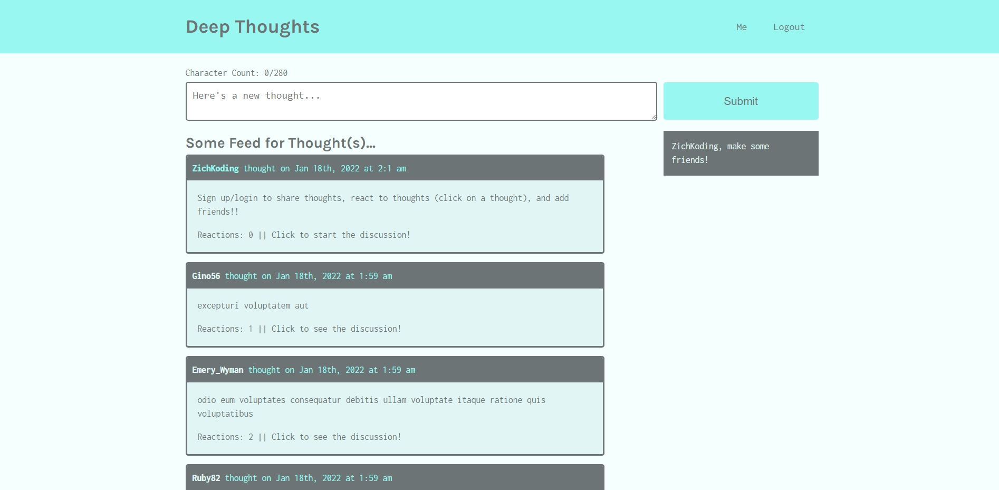

# ***Deep Thoughts by ZichKoding***

[*Click here for live application*](https://deepthoughts-zichkoding.herokuapp.com)

## ***Description***
Here is a social media platform leveraging the whole MERN stack along with GraphQL and Apollo Server to bring you a place to share your thoughts, react with other thoughts, and make new friends!
#
## *Table of Contents*
* [How to sign up](#How-to-sign-up)
* [How to login](#How-to-login)
* [How to create a thought](#How-to-create-a-thought)
* [How to react to a thought](#How-to-react-to-a-thought)
* [How to add a friend](#How-to-add-a-friend)
#
### ***How to sign up***
To sign up click the `Sign up` link in the top right corner of the navbar. Once on the sign up page, fill out the forms and press enter. This will bring you back to the homepage.
#
### ***How to login***
To sign up click the `Login` link in the top right corner of the navbar left of `Sign up`. Once on the login page, fill out the forms and press enter. This will bring you back to the homepage.
#
### ***How to create a thought***
Once you are signed or logged in you can create a thought on the homepage or click `Me` in the top right corner next to `Logout` and scroll down to the form to create a new thought.
#
### ***How to react to a thought***
To create a reaction to a thought just simply click on any thought *(as long as your are logged in)* and there will be a form below the thought to add a reaction.
#
### ***How to add a friend***
If you wish to add a friend, then click on the username of any thought or reaction. This will bring you to that user's profile page where there will be a `Add Friend` button at the top right just below the nav bar. 
#